## Hi! 👋
---

I'm a ***Computer Science*** and ***Engineering*** student at the [University of Bologna](https://corsi.unibo.it/laurea/IngegneriaScienzeInformatiche). On this GitHub profile, you'll find a collection of projects that I've worked on during my studies.

## 🚀 About Me
🌱 I’m currently studying Computer Science and Engineering at the University of Bologna.
I've had a couple of jobs as a software developer 

## 🔧 Technologies & Tools

# 📚 Projects
Here are some of the projects I’ve worked on:

### Con Nome
A little game made for the [MMA-2023](https://www.dm.unibo.it/pls/metodi-matematici-per-l-animazione-2023/).
- 🥉 3rd Place

---
### Auto Ercole
A project made in collaboration with [Arakne Srl](https://www.arakne.it/en/home) consisting in the developement of an application to reassemble fragments of ancient frescoes

---

## 📫 Let's Connect!

<!--
**delpiter/delpiter** is a ✨ _special_ ✨ repository because its `README.md` (this file) appears on your GitHub profile.

Here are some ideas to get you started:

- 🔭 I’m currently working on ...
- 🌱 I’m currently learning ...
- 👯 I’m looking to collaborate on ...
- 🤔 I’m looking for help with ...
- 💬 Ask me about ...
- 📫 How to reach me: ...
- 😄 Pronouns: ...
- ⚡ Fun fact: ...
-->
